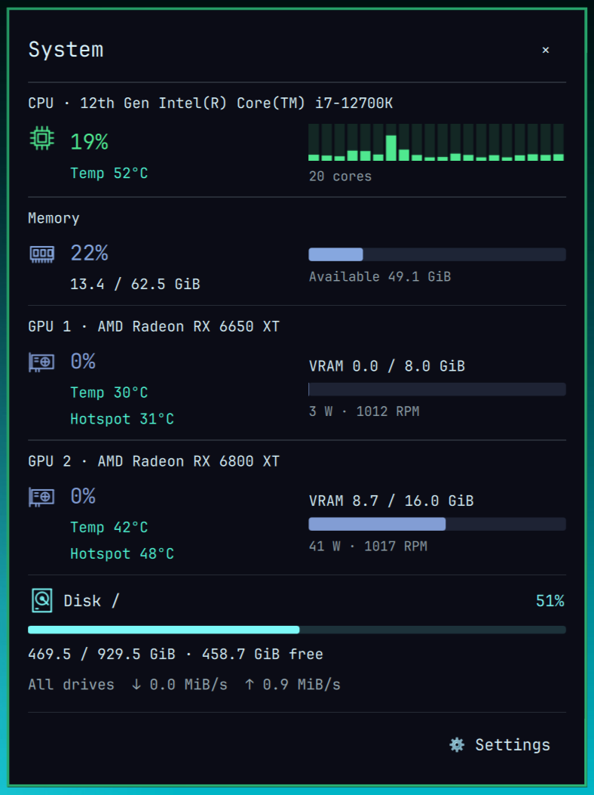
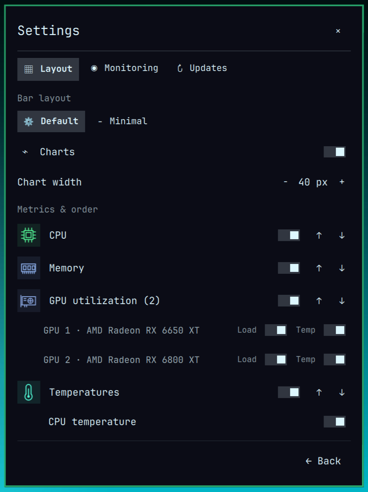
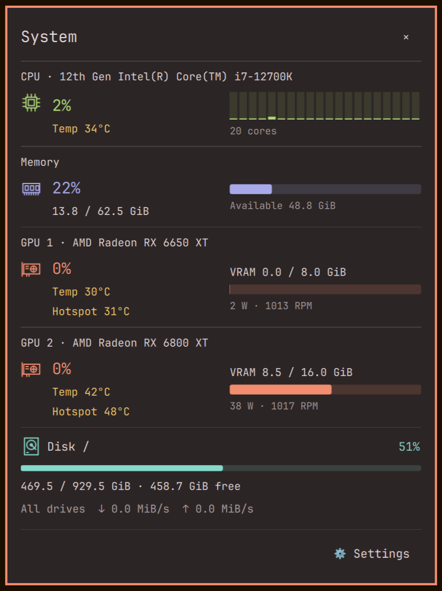
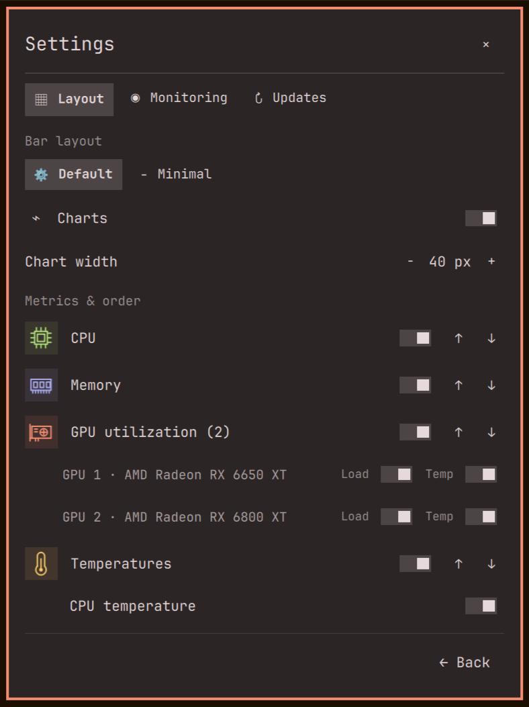
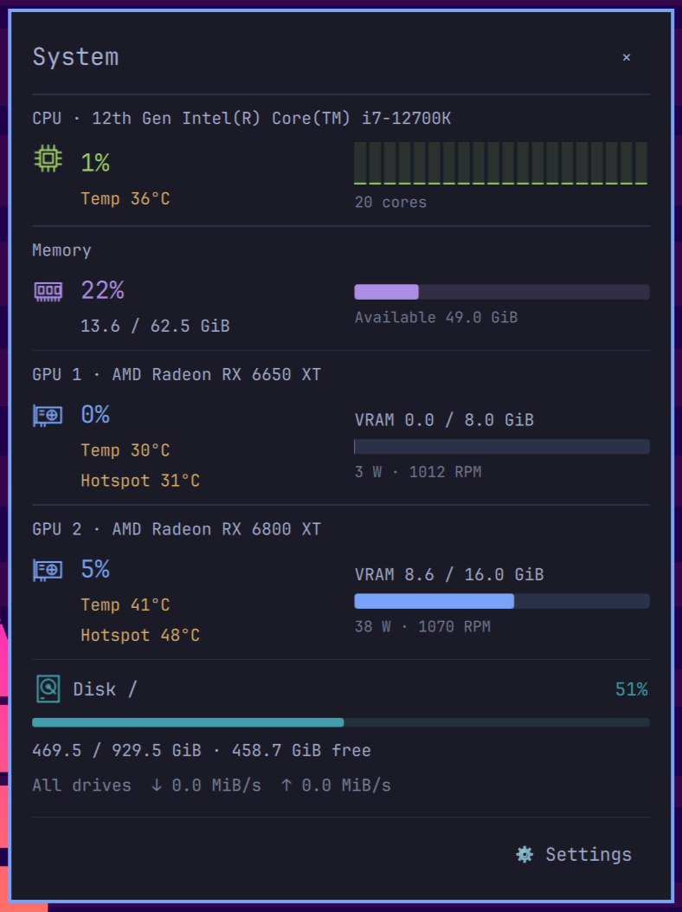
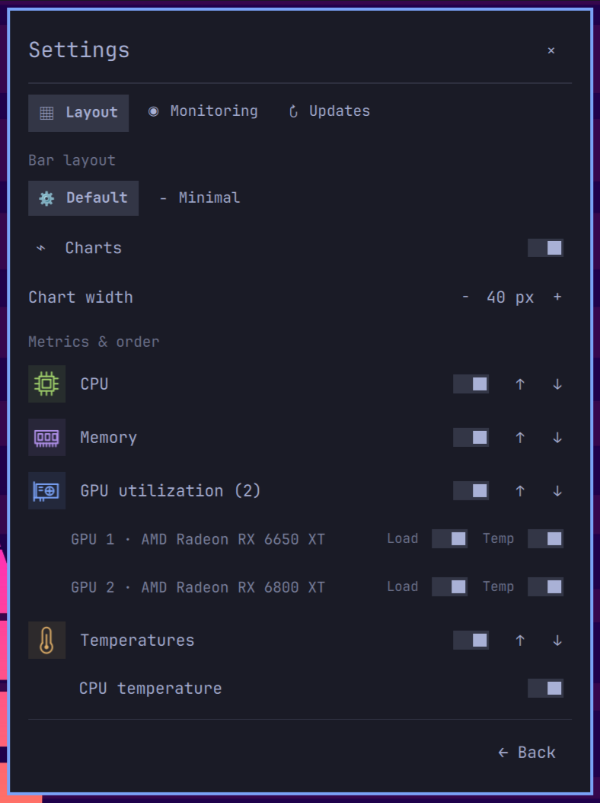

# Omarchy Statusline

[](https://linux.do/)

A native **Omarchy Shell system monitor** built with Quickshell/QML and Python. Live CPU, GPU, memory and temperature graphs fit directly into your Linux status bar and follow your Omarchy theme.

The default widget shows CPU load with per-core bars, memory usage with a meter, each detected GPU's utilization, and separate CPU and per-GPU temperatures. Click it for the system detail panel with 60-second history, VRAM, power, fan speed, CPU/GPU/hotspot temperatures for every detected GPU. Escape, the close button, or a click outside dismisses the panel.

## Screenshots

These screenshots show the same widget layout under three dark Omarchy themes.

### Example: Hackerman


| System monitor | Settings |
| --- | --- |
|  |  |

### Example: Ristretto


| System monitor | Settings |
| --- | --- |
|  |  |

### Example: Tokyo Night


| System monitor | Settings |
| --- | --- |
|  |  |

Omarchy Statusline follows whichever Omarchy theme is active; these three themes are examples, not the only supported themes. No plugin theme setting is needed.

## Quick install

```bash
omarchy plugin add https://github.com/lucaslus/omarchy-statusline.git --enable --yes
```

[Latest release](https://github.com/lucaslus/omarchy-statusline/releases/latest) · [CI checks](https://github.com/lucaslus/omarchy-statusline/actions)

To remove a normal installation, run:

```bash
omarchy plugin remove lucas.system-pulse
```

Omarchy asks for confirmation, unloads the plugin if enabled, and removes its installed checkout. For a development installation, use the checkout-specific uninstall script below.

## Requirements

- Linux with the **Quickshell-based Omarchy Shell**, including third-party plugins and `qs.Ui.KeyboardPanel`. Legacy Waybar-based Omarchy is not supported.
- Python 3.11+ (standard library only; no pip dependencies).
- Optional: `nvidia-smi` for NVIDIA telemetry.

Developed and smoke-tested against the Omarchy Shell installed on September 10, 2026. Shared `qs.Ui` / `qs.Commons` interfaces are supplied by Omarchy and can change with shell updates.

## Install this checkout

```bash
./scripts/install.sh
```

This backs up `shell.json`, links this repository into the user plugin directory, and enables the widget at the start of the existing right section. Keep the checkout in place. Running the installer again is safe for the same checkout; an unrelated installation is left untouched.

After source edits, run `omarchy-shell shell rescanPlugins`. If the running QML engine retains old components, use `omarchy restart shell` to load the new version.

Remove the development installation:

```bash
./scripts/uninstall.sh
```

Removal disables only this widget and removes its symlink. It does not restore an old copy of your entire bar configuration.

For a normal Git-managed Omarchy installation:

```bash
omarchy plugin add https://github.com/lucaslus/omarchy-statusline.git --enable --yes
```

## Settings and layout

Click the widget to open the detail panel, then choose **Settings**. Right-click opens Settings directly. Settings are saved in the widget’s existing `shell.json` entry and shared by all monitors.

The settings page has three tabs, with detail panel options inside Layout:

- **Layout**: Default (the initial setup, with adjustable charts) or Minimal (full metric labels and no charts). Each bar metric has its label on the left and its value overlaid on the chart on the right. Select and reorder CPU/memory/GPU/temperature/disk groups, then control each detected GPU's utilization and temperature readouts separately. In Default, you can show or hide charts and adjust chart width from 20–80 logical pixels. At least one metric group stays enabled. Existing `overview`, `custom`, and `compact` bar settings load as Default; saved `stackedLabels` values are ignored.
- **Detail panel (Layout)**: System and Settings share a 440 × 558 logical-pixel content frame, constrained by available screen space. Overview shows history below each metric; Compact uses smaller rows without those history strips. Temperature history follows the history visibility setting.
- **Monitoring**: choose 1, 2, or 5 second sampling; configure startup; pause/resume; exit this session; or disable the plugin entirely.
- **Updates**: see the installed version, the Git-managed update command, and the official plugin guide. Local development installs update through their source checkout.

Bar width adapts independently to the space available on each monitor, reserving room for the clock and neighboring widgets. On narrow screens it hides charts first, then shows only the metrics that fit in your chosen order; click for all details. If necessary it collapses to a small launcher. The full layout returns when space is available, without changing saved settings. The plugin fits the host bar and never creates another bar. Left/right vertical bars use the CPU/memory readout and the same settings and detail panel.

```bash
omarchy bar set lucas.system-pulse layout default
omarchy bar set lucas.system-pulse detailLayout compact
omarchy bar move lucas.system-pulse --before omarchy.network
omarchy-shell shell summon lucas.system-pulse '{}'
omarchy-shell shell hide lucas.system-pulse
```

Bar height is controlled by `size-horizontal` in the `[bar]` section of `~/.config/omarchy/shell.toml`. This machine preference affects the whole bar; the installer does not change it.

## Startup, pause and exit

Omarchy already starts its shell at login; Omarchy Statusline does not install another startup service. **Start automatically at login** controls whether sampling begins when the shell starts. When off, only a small launch button remains until **Start monitoring** is selected.

**Exit this session** stops sampling and retries on all monitors, keeping that small launch button. Next login (or shell restart) follows the saved startup preference. **Disable Omarchy Statusline** removes the widget entirely; re-enable it through Omarchy’s plugin settings or `omarchy plugin enable lucas.system-pulse`.

The collector runs only while at least one widget consumes it and the session is enabled. Removing the last widget stops both its process and watchdog.

## Updating

Use Omarchy’s plugin manager for a normal Git-managed installation:

```bash
omarchy plugin update lucas.system-pulse
```

Run it in a terminal and follow Omarchy’s prompts. `plugin add` takes the GitHub repository URL for a first installation; `plugin update` takes the installed plugin ID and uses its saved Git remote. **Settings → Updates** shows the update command and links to the [Omarchy plugin guide](https://omarchy.org/manual/shell-plugins/). The plugin itself does not download or apply updates.

Omarchy rescans plugins after a Git-managed update, and plugin file changes normally reload automatically. If the updated interface does not appear, run `omarchy restart shell` to clear cached QML components. Development symlinks and worktrees should be updated through their source checkout.

## Themes

The plugin has no separate theme selector: switching the Omarchy theme updates its panel surfaces, text, borders, and metric charts to match. Fonts, spacing, and rounding use Omarchy's shared `Color`, `Style`, and native popup components. Metric colors use the current theme's green, magenta, blue, and yellow (ANSI `color2/5/4/3` fallback), then the shell accent. The current palette is reread on each sample, including after theme directory/symlink replacement. Both named-color and ANSI palettes work; no theme files or hooks are modified.

## Telemetry and limitations

One shared Python collector serves every monitor and emits JSON at the configured interval (two seconds by default). History is bounded to 60 seconds by timestamp, with a 62-sample hard limit. Old samples expire during an outage; gaps are not connected and GPU adapter changes do not mix histories. CPU utilization uses differences between `/proc/stat` samples; the initial sample is unknown. Memory usage is `MemTotal - MemAvailable`, measured in GiB.

| Hardware | Source / support |
| --- | --- |
| CPU | `/proc/stat`, per logical core; coretemp/k10temp/zenpower/cpu_thermal hwmon temperatures |
| AMD GPU | DRM sysfs busy percentage, VRAM, edge/junction temperature, power and RPM where exposed |
| NVIDIA GPU | Optional `nvidia-smi`, bounded to a 1.2-second timeout; utilization, VRAM, temperature, power |
| Intel / other GPU | Adapter detection; only metrics actually exported through the supported sysfs files |

On multiple GPUs, the status bar labels each detected adapter GPU1, GPU2, and so on, with separate utilization and temperature readouts. Settings lists each adapter by name and saves its bar switches by adapter ID. The detail panel lists every detected GPU with its own utilization, VRAM, power, fan, temperature, hotspot, and history where available. Full adapter data is included in collector JSON. Unsupported metrics show `—`, never a fabricated zero. Sensor availability and permissions vary by driver. No root access or sensor probing commands are required. NVIDIA queries may wake a sleeping discrete GPU.

If an enabled collector exits it is retried; missing updates dim the bar and mark the detail panel offline. History is in memory only and resets on restart. The settings screen and missing metrics remain usable without supported GPU sensors.

Disk capacity describes the root filesystem (`/`). Read/write rates aggregate whole hardware block devices exposed by `/sys/block/*/device`, excluding partitions and virtual mapper layers to avoid double counting. The first sample has no rate. Enable **Disk /** in Settings to add its capacity meter to the horizontal bar; it is off by default. The detail panel always includes disk information and scrolls within its fixed frame.

## Development and verification

```bash
python3 collector.py --once
python3 -m unittest discover -s tests -v
bash -n scripts/install.sh scripts/uninstall.sh
python3 scripts/test-qml.py
```

The Python tests cover telemetry and asynchronous installation registration. The native QML tests run in a temporary, windowless Quickshell instance and cover timestamp expiry, settings persistence signals and scrolling, local version display and host update guidance, layouts, multi-monitor lifecycle, startup preferences and pause/resume. Native tests require an Omarchy desktop session; the GitHub CI job runs the Python and shell checks. AMD telemetry and native shell integration were exercised on the development machine. NVIDIA parsing is fixture-tested, not verified on physical NVIDIA hardware.

Files: `Widget.qml` is the bar entry point, `Detail.qml` is the popup, `SettingsPage.qml` contains the settings, `Metrics.qml` manages sampling consumers, `History.js` manages the timeline, `collector.py` reads hardware data, and the small QML components render the charts.

## Releases and marketplace updates

Set the version in `manifest.json`, update `RELEASE_NOTES.md` and the preview if needed, validate the plugin, then commit and push the new code to the public repository. A matching `vX.Y.Z` tag triggers this repository's GitHub Release workflow, which runs Python tests and shell validation before publishing a source archive with SHA-256 checksums. The GitHub Release is separate from the Omarchy Plugin Marketplace listing.

For this already listed plugin, use the Marketplace's [verification and update form](https://github.com/omacom/omarchy-plugin-marketplace/issues/new?template=verify-plugin.yml) with **Verify and publish a newer upstream commit**. Enter `lucas.system-pulse`, the [repository root URL](https://github.com/lucaslus/omarchy-statusline), and the full 40-character SHA of the pushed default-branch HEAD. The Marketplace validates that exact commit and updates the listing after its review and publication workflow succeeds; pushing or tagging alone does not publish a new verified snapshot. See the [official verification guide](https://github.com/omacom/omarchy-plugin-marketplace/blob/main/VERIFICATION.md).

Users with a normal Git-managed installation can then run `omarchy plugin update lucas.system-pulse`. A development symlink uses its local checkout instead. Omarchy's update command follows the repository's current HEAD, so the installed commit is not pinned to the Marketplace's verified snapshot.

## License

[MIT License](LICENSE) · Copyright (c) 2026 lucas.
