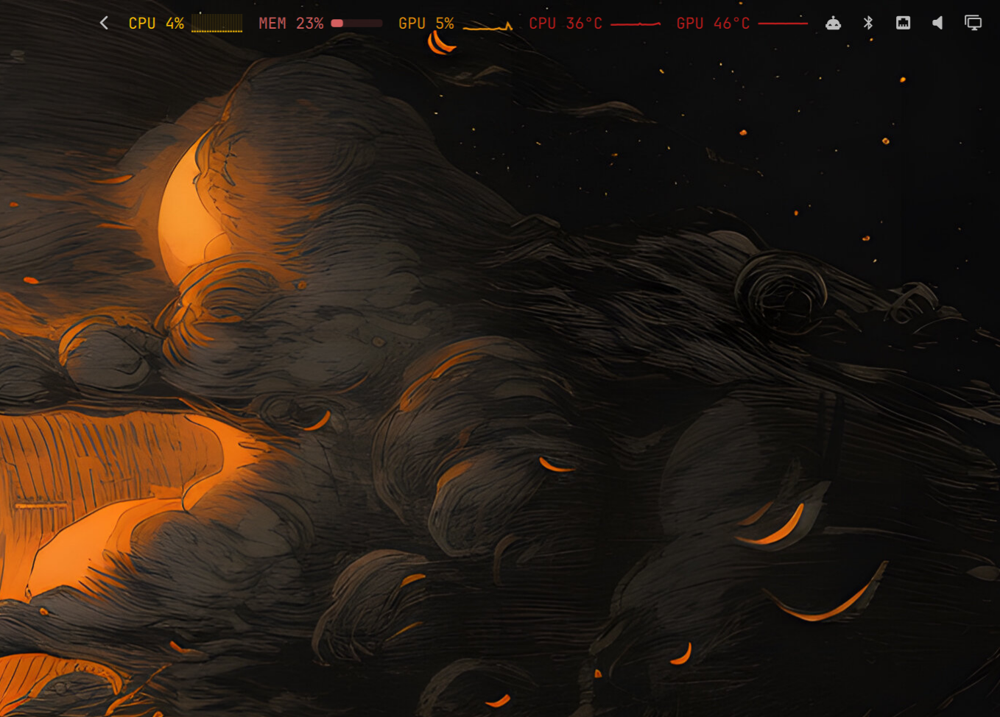
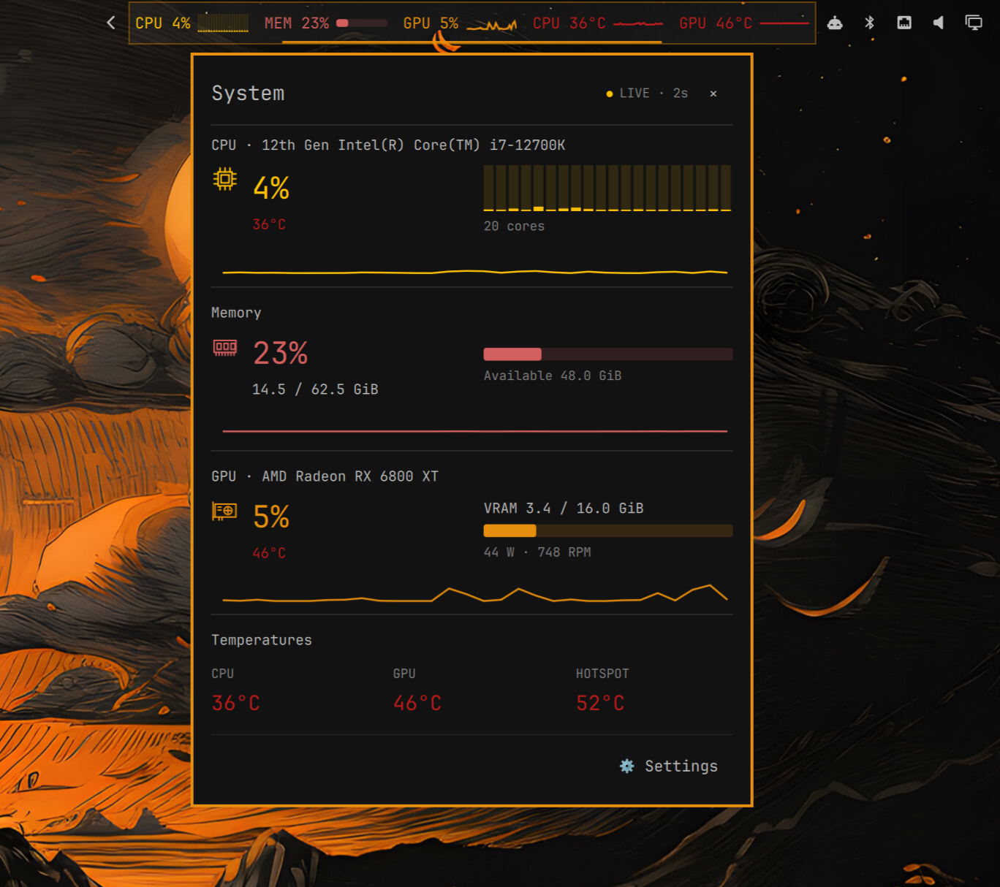
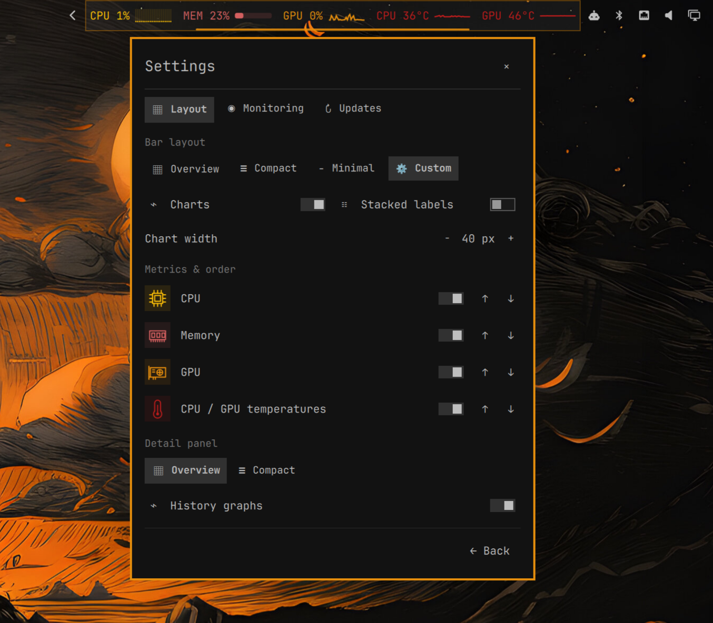

# Omarchy Statusline — System Pulse

A native **Omarchy Shell system monitor** built with Quickshell/QML and Python. Live CPU, GPU, memory and temperature graphs fit directly into your Linux status bar and follow your Omarchy theme.

The default widget shows CPU load with per-core bars, memory usage with a meter, GPU utilization with a sparkline, and separate CPU/GPU temperatures with sparklines. Click it for the system detail panel with 60-second history, VRAM, power, fan speed, CPU/GPU/hotspot temperatures. Escape, the close button, or a click outside dismisses the panel.

## Screenshots



| System monitor | Settings |
| --- | --- |
|  |  |

## Quick install

```bash
omarchy plugin add https://github.com/lucaslus/omarchy-statusline.git --enable --yes
```

[Latest release](https://github.com/lucaslus/omarchy-statusline/releases/latest) · [CI checks](https://github.com/lucaslus/omarchy-statusline/actions)

## Requirements

- Linux with the **Quickshell-based Omarchy Shell**, including third-party plugins and `qs.Ui.KeyboardPanel`. Legacy Waybar-based Omarchy is not supported.
- Python 3.11+ (standard library only; no pip dependencies).
- Optional: `nvidia-smi` for NVIDIA telemetry.

Developed and smoke-tested against the Omarchy Shell installed on September 10, 2026. Shared `qs.Ui` / `qs.Commons` interfaces are supplied by Omarchy and can change with shell updates.

## Install this checkout

```bash
./scripts/install.sh
```

This backs up `shell.json`, links this repository into the user plugin directory, and enables the widget at the start of the existing right section. Keep the checkout in place. Running the installer again is safe for the same checkout; an unrelated installation is left untouched.

After source edits, run `omarchy-shell shell rescanPlugins`. If the running QML engine retains old components, use `omarchy restart shell` to load the new version.

Remove the development installation:

```bash
./scripts/uninstall.sh
```

Removal disables only this widget and removes its symlink. It does not restore an old copy of your entire bar configuration.

For a normal Git-managed Omarchy installation:

```bash
omarchy plugin add https://github.com/lucaslus/omarchy-statusline.git --enable --yes
```

## Settings and layout

Click the widget to open the detail panel, then choose **Settings**. Right-click opens Settings directly. Settings are saved in the widget’s existing `shell.json` entry and shared by all monitors.

The settings page has three tabs:

- **Layout**: Overview (original stacked labels and charts), Compact (one line with charts), Minimal (numbers), or Custom. Select CPU/memory/GPU/temperature, reorder them, show or hide charts, choose stacked labels, and adjust custom chart width from 20–80 logical pixels. At least one metric stays enabled.
- **Detail panel**: System and Settings share a 440 × 558 logical-pixel content frame, constrained by available screen space. Overview shows history below each metric; Compact uses smaller rows without those history strips. Temperature history follows the history visibility setting.
- **Monitoring**: choose 1, 2, or 5 second sampling; configure startup; pause/resume; exit this session; or disable the plugin entirely.
- **Updates**: inspect the installed version, check for a new Git commit, update in a terminal, and reload Omarchy Shell afterward.

Bar width follows its actual contents. The plugin fits the host bar and never creates another bar. Left/right vertical bars use the CPU/memory readout and the same settings and detail panel.

```bash
omarchy bar set lucas.system-pulse layout compact
omarchy bar set lucas.system-pulse detailLayout compact
omarchy bar set lucas.system-pulse metrics '["cpu","memory","gpu","heat"]' --json
omarchy bar move lucas.system-pulse --before omarchy.network
omarchy-shell shell summon lucas.system-pulse '{}'
omarchy-shell shell hide lucas.system-pulse
```

For more readable stacked labels, set `size-horizontal = 36` in the `[bar]` section of `~/.config/omarchy/shell.toml` (merge with existing settings). This machine preference survives theme switches and affects the whole bar. The installer does not change bar height automatically.

## Startup, pause and exit

Omarchy already starts its shell at login; System Pulse does not install another startup service. **Start automatically at login** controls whether sampling begins when the shell starts. When off, only a small launch button remains until **Start monitoring** is selected.

**Exit this session** stops sampling and retries on all monitors, keeping that small launch button. Next login (or shell restart) follows the saved startup preference. **Disable System Pulse** removes the widget entirely; re-enable it through Omarchy’s plugin settings or `omarchy plugin enable lucas.system-pulse`.

The collector runs only while at least one widget consumes it and the session is enabled. Removing the last widget stops both its process and watchdog.

## Updating

Updates follow the installed Git repository’s `origin` default branch; checks are manual and fetch metadata without changing checked-out files. **Update in terminal** fast-forwards to the exact commit offered by the last check, after validating its plugin manifest and entry point. Reload Omarchy Shell afterward to clear cached QML components; this reload affects the whole shell.

Development symlinks, linked worktrees, uncommitted repositories and installations with local changes are not automatically updated. The update helper never stashes or resets user changes, never performs a non-fast-forward merge, and refuses to overwrite ignored local files. Updates track the default branch, rather than release tags. Development installations should be updated through their source checkout.

## Themes

Panel surfaces, text, borders, fonts, spacing, and rounding use Omarchy's shared `Color`, `Style`, and native popup components. Metric colors use the current theme's green, magenta, blue, and yellow (ANSI `color2/5/4/3` fallback), then the shell accent. The current palette is reread on each sample, including after theme directory/symlink replacement. Both named-color and ANSI palettes work; no theme files or hooks are modified.

## Telemetry and limitations

One shared Python collector serves every monitor and emits JSON at the configured interval (two seconds by default). History is bounded to 60 seconds by timestamp, with a 62-sample hard limit. Old samples expire during an outage; gaps are not connected and GPU adapter changes do not mix histories. CPU utilization uses differences between `/proc/stat` samples; the initial sample is unknown. Memory usage is `MemTotal - MemAvailable`, measured in GiB.

| Hardware | Source / support |
| --- | --- |
| CPU | `/proc/stat`, per logical core; coretemp/k10temp/zenpower/cpu_thermal hwmon temperatures |
| AMD GPU | DRM sysfs busy percentage, VRAM, edge/junction temperature, power and RPM where exposed |
| NVIDIA GPU | Optional `nvidia-smi`, bounded to a 1.2-second timeout; utilization, VRAM, temperature, power |
| Intel / other GPU | Adapter detection; only metrics actually exported through the supported sysfs files |

On multiple GPUs, the first adapter with utilization telemetry is displayed (otherwise the first detected adapter). Full adapter data is included in collector JSON. Unsupported metrics show `—`, never a fabricated zero. Sensor availability and permissions vary by driver. No root access or sensor probing commands are required. NVIDIA queries may wake a sleeping discrete GPU.

If an enabled collector exits it is retried; missing updates dim the bar and mark the detail panel offline. History is in memory only and resets on restart. The settings screen and missing metrics remain usable without supported GPU sensors.

## Development and verification

```bash
python3 collector.py --once
python3 -m unittest discover -s tests -v
bash -n scripts/install.sh scripts/uninstall.sh
python3 scripts/test-qml.py
```

The Python tests cover telemetry, asynchronous installation registration, and updates against local Git fixtures (including dirty/development checkouts, manifest validation and ignored-file protection). The native QML tests run in a temporary, windowless Quickshell instance and cover timestamp expiry, settings persistence signals and scrolling, layouts, multi-monitor lifecycle, startup preferences and pause/resume. Native tests require an Omarchy desktop session; the GitHub CI job runs the Python and shell checks. AMD telemetry and native shell integration were exercised on the development machine. NVIDIA parsing is fixture-tested, not verified on physical NVIDIA hardware.

Files: `Widget.qml` is the bar entry point, `Detail.qml` is the popup, `SettingsPage.qml` contains the settings, `Metrics.qml` manages sampling consumers, `History.js` manages the timeline, `collector.py` reads hardware data, `maintenance.py` handles updates, and the small QML components render the charts.

## Releases

Set the version in `manifest.json`, update `RELEASE_NOTES.md`, commit and push, then push a matching `vX.Y.Z` tag. GitHub Actions checks the version, runs Python tests and shell validation, and publishes a source archive with SHA-256 checksums. A failed validation prevents publication.
